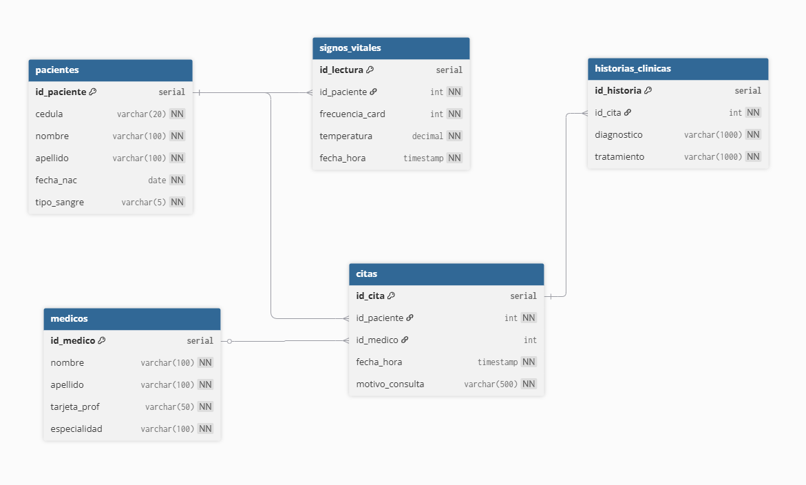

# Taller HealthPulse

## Diagrama

## Modularidad
###### La tabla de signos vitales solo está relacionada con pacientes y no depende de ninguna de las otras, lo que lA hace un modulo independiente. Entonces si el sistema de monitoreo de signos vitales crece y necesita su propio servidor, se puede mover a otra base de datos mantebiebdo el id_paciente como referencia externa, sin necesidad de modificar otra tabla.

## Acoplamiento

###### La tabla citas es el centro del sistema, esto se debe a que es la unica que conecta a pacientes con medicos y de ella depende historias clinicas. Entonces cualquier cambio estrutural importante en la tabla, haria actualizar todas las llaves foraneas de historias clinicas y revisar todas las consultas que la utilizan, haciendola el punto de mayor reisgo en el sistema.

## Cohesión

###### Hacer esto es un error porque una cita medica y una historia clinica son cosas diferentes: mientras que la cita representa el evento de agendamiento, la historia clinica es el resultado medico. Unir ambas en una sola tabla haria que citas tuviera dos responsabilidades, rompiendo el principio de cohesión y generando inconsistencias, porque una cita puede existir sin un diagnostico aún, obligando a dejar esos campos vacios. 

